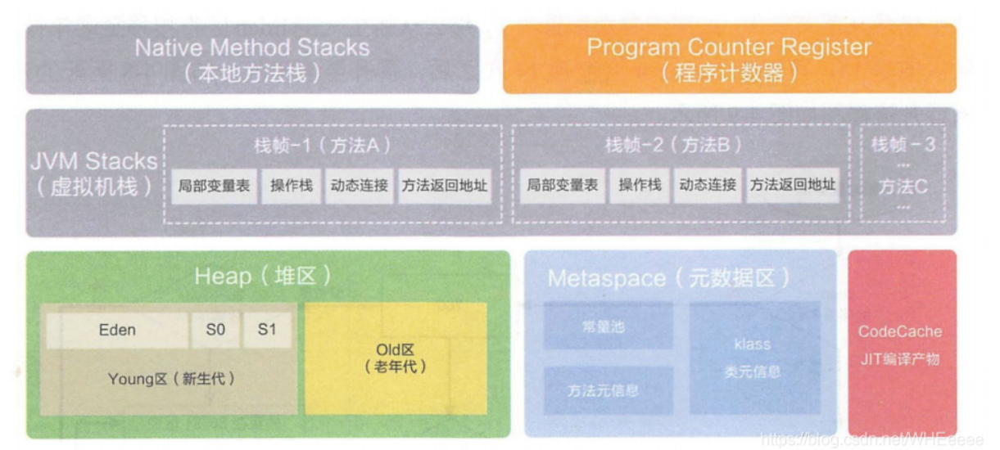

线程私有：java虚拟机栈、本地方法栈、程序计数器

线程共有：堆、元空间（JDK1.7叫做方法区）

各区域的作用

堆：所有的对象都是存在于此区域，此区域也是JVM中最大的一块区域，垃圾回收主要针对此区域。

java虚拟机栈(JVM栈)：

局部变量表：8大基本数据类型（int、short、long、float、double、boolean、char、byte）、对象的引用，也就是方法参数和局部变量

操作栈：每个方法都对应一个先进后出的操作栈

动态链接：指向运行时常量池的方法引用

# static和final的区别

## 	static:

​				修饰变量：静态变量苏浙类加载时完成初始化，内存中只有一个，且JVM只会为它分配一次内存，所有类共享静态变量

​				修饰方法：在类加载器的时候就存在，不依赖任何实例；static方法必须实现，不能用abstract修饰

​				修饰代码块：在类加载完成之后会执行代码块中的内容

​				父类静态代码块 -> 子类静态代码块 -> 父类非静态代码块 -> 父类构造方法 -> 子类非静态代码块 -> 子类构造方法

## 	finall

​				修饰变量：

​							编译器常量：类加载的过程中完成初始化，编译后带入任何计算式中，只能是基本类型

​							运行时常量：基本数据类型或引用数据类型。引用不可变，但引用的对象内容可变。

​				修饰方法：不能被继承

​				修饰类：不能被继承

​				修饰形参：final形参不可变