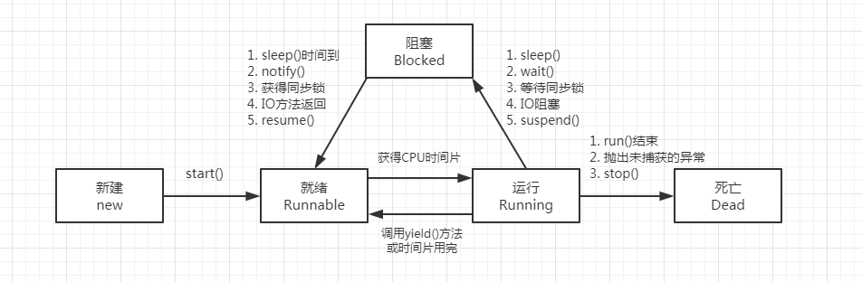
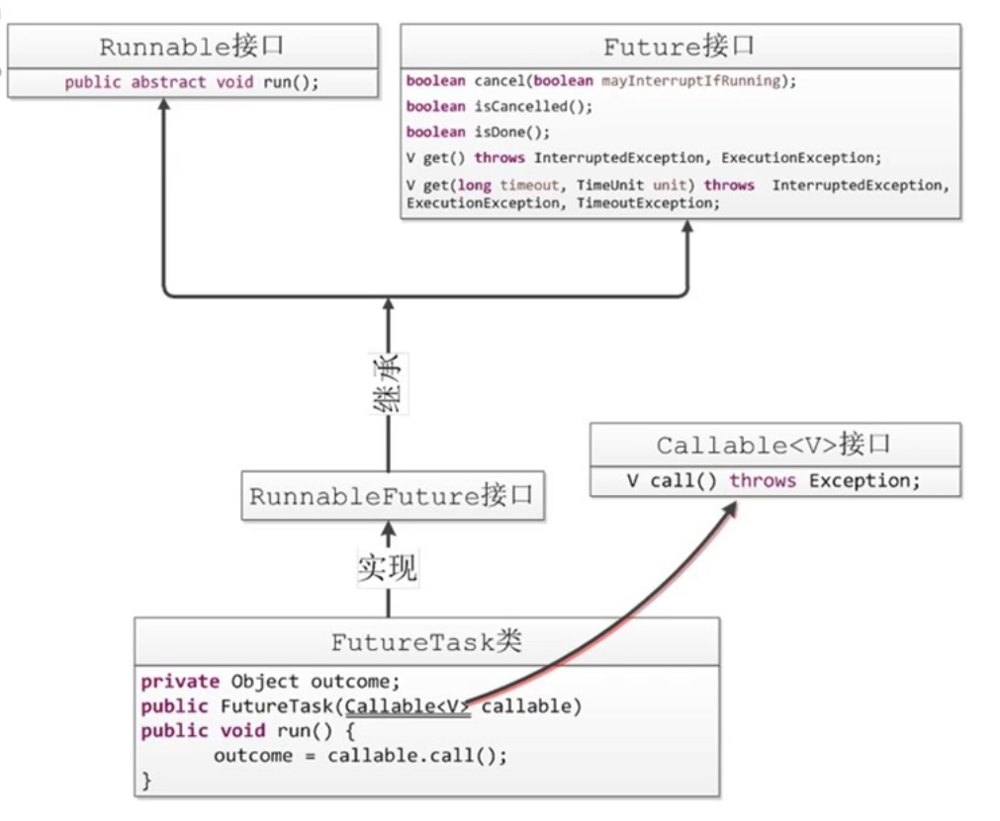

多线程

​    

### 启动线程的方式：

​		1.继承Thread 2.实现Runable 3.实现Callable 4.线程池

用start()启动线程，run()只是普通方法。

设置守护线程的话就在start方法调用之前，使用.setDeamon(true)方法，守护线程跟主线程会一起死

如果实现Callable接口的话，需要用FutureTask包装类来嵌套，如下

```java
UseCallable useCallable = new UseCallable();
FutureTask<String> futureTask =new FutureTask<>(useCallable); 
new Thread(futureTask).start(); 
System.out.println(futureTask.get());//get方法是阻塞的，一直等着回来结果
```


#### 终止线程的方式有

​						stop();强制终止，不一定释放资源-

​						interrupt() 中断一个线程，由线程决定什么时候终止

​						isInterrupted()判断线程是否处在终止状态

​						interrupted()判断线程是否处在终止状态，并且将中断标识位改为false

​						yield() 让出CPU的执行权，自己去重新排队

#### sleep()和wait()的区别

​		sleep():不释放锁，不会被唤醒，操作当前线程

​		wait():必须放在Sychronized block中不然会抛出异常，会释放锁，可以被唤醒，属于Object方法。


#### notify()和notifyAll()

​		notify():唤醒线程栈上最先wait的线程，不确定能不能唤醒想唤醒的

​		notifyAll():唤醒所有线程，保证唤醒成功


#### fork/join 框架

​		使用分而治之的思想来解决问题。需要extends RecursiveAction并重写compute方法，使用ForkJoinPool线程池，来实现，在compute里使用递归来解决需求。


#### CountDownLatch

​		线程屏障，一个或者多个线程等待另外N个线程完成后再继续执行。

```java
CountDownLatch countDownLatch = new CountDownLatch(3); 
//子线程运行 
countDownLatch.countDown();  // 3-1 
//主线程运行 
countDownLatch.await(); //无参数时等被减到0才会继续继续执行。 
countDownLatch.await(long timeout,TimeUnit unit); 等待若干时间，如果没被减到0，那这个线程也要继续走
```


#### CyclicBarrier（读音 塞克利克掰瑞儿）

​		循环屏障，首先new 一个cyclicBarrier对象定义需要等待的线程数量N，在线程中调用cyclicBarrier.await()实现加一操作，一直加到自定的N时各个线程await()后面的方法才会执行。如果使用两个参数的方式，第二个参数相当于是最后一个调用cyclicBarrier.await()的线程在运行，先运行这个匿名方法，运行完成才会放开栅栏，各个线程运行自己cyclicBarrier.await()后面的代码。

```
 public static CyclicBarrier cyclicBarrier = new CyclicBarrier(10);
public static CyclicBarrier cyclicBarrier = new CyclicBarrier(10, () -> {
        //模拟倒酒，花了2秒，又得让其他9个人等2秒
        try {
            TimeUnit.SECONDS.sleep(2);
        } catch (InterruptedException e) {
            e.printStackTrace();
        }
        System.out.println(Thread.currentThread().getName() + "说，不好意思，让大家久等了，给大家倒酒赔罪!");
    });
```

CycliBarrier的计数器可以重置，在同一个线程中的多个方法调用了await()方法的时，每个方法的计数是自己单独计的，互不影响

```
 public static class T extends Thread {

           @Override
        public void run() {
            //等待所有人到齐之后吃饭，先到的人坐那等着，什么事情不要干
            this.eat();
            //等待所有人到齐之后开车去下一景点，先到的人坐那等着，什么事情不要干
            this.drive();
        }
        void eat() {
            try {
                cyclicBarrier.await();
            } catch (InterruptedException e) {
                e.printStackTrace();
            } catch (BrokenBarrierException e) {
                e.printStackTrace();
            }
        }
        void drive() {
            try {           
                cyclicBarrier.await();
            } catch (InterruptedException e) {
                e.printStackTrace();
            } catch (BrokenBarrierException e) {
                e.printStackTrace();
            }
        }
  }
```


#### CountDownLatch和CyclicBarrier的区别

​		CountDownLatch相当于主线程等着其他子线程的运行到调用CountDownLatch的countDown()方法每次减一，一直把创建CountDownLatch定义的次数减到0或者在await（long timeout, TimeUnit unit）定义的时间超出，主线程再继续运行

​		CyclicBarrier相当于各个子线程自己运行，子线程用了CyclicBarrier的await()这里的await()方法会给计数器加一然后等待其他线程，一直到自定义的次数或者 其中某个线程被中断(比如主线程调用某个子线程的interrupt()方法)那所有等待已经没有开始等待的线程都会直接开始运行并抛出BrokenBarrierException异常。相当于只要await()的线程只要有一个不等待了，那所有都不等了


#### Semaphore 中文名叫信号量   [详细](https://blog.csdn.net/admans/article/details/125957120?ydreferer=aHR0cHM6Ly93d3cuYmFpZHUuY29tL2xpbms%2FdXJsPTNZLXgwVTNUelBUOUZwUEdlLXpVaEFLMzgwVUNjaW1Ub1BUXzJ6eWUxcmVtaUFOamJDYTdNYVBlUmgyTk1ZblZjaEREdXJtT0xjSG9RY1ZRSTZTTkRLJndkPSZlcWlkPWZmN2UwNzZiMDAwYWJiZDAwMDAwMDAwNDY0Mzc0ZGI2)

​		控制同时访问某个特定资源的线程数量，用于流量控制。

##### 		获取锁的方法

​				acquire() 线程占用一个许可

​				acquire(int n) 线程占用n个许可

​				acquireUninterruptibly()线程占用一个许可，调用不可被打断

​				acquireUninterruptibly(int n) 线程占用n个许可，调用不可被打断

​				release()  线程释放一个许可


#### Exchanger（使用较少）

用于两个线程之间通讯，无论哪个线程先调用都会等待另一个线程调用时进行数据交换

```
public class TestExchanger {

    private static Exchanger<String> exchanger = new Exchanger<>();

    public static void main(String[] args) {
        new Thread(()->{
            try {
                String aa = exchanger.exchange("V1");
                System.out.println(Thread.currentThread().getName() + aa);
            } catch (InterruptedException e) {
                e.printStackTrace();
            }
        }, "T1").start();

        new Thread(()->{
            try {
                String bb = exchanger.exchange("V2");
                System.out.println(Thread.currentThread().getName() + bb);
            } catch (InterruptedException e) {
                e.printStackTrace();
            }
        }, "T2").start();
    }
}

```


#### Runable、Future、RunnableFuture、FutureTask的关系




#### FutureTask.cancel(boolean):

​		1.任务还没开始或者已经结束的返回false

​		 2.任务开始的中断任务，返回true

#### CAS(Compare And Swap)  指令级别保证这是一个原子操作

​		三个运算符：  一个地址内存V ，一个旧的期望值A， 一个新值B

​		如果地址V上的值和期望值A相等，那就给地址V赋值B。如果不等，则不做任何操作，循环（死循环，自旋）里不断的进行CAS操作，自旋时会重新获取旧的期望值A

##### 		CAS带来了三个问题：

​				1.ABA问题 ----->使用版本号

​				2.开销问题，CAS长期失败，一直自旋

​				3.只能保证一个共享变量的原子操作


Atomic包下的例如AtomicIntegerArray、AtomicReference、AtomicStampedRefence等使用的引用对象的类，不会改变引用对象本身


Sychronized

ReentrantLock

ReentrantWriteLock